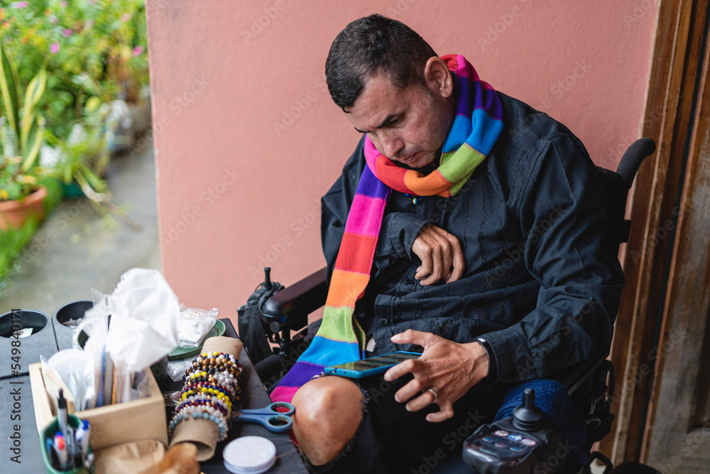

So you’re ready to start getting accessible! You understand the importance of designing and building [digital products for human beings](https://heynova.io/blog/the-undeniable-importance-of-web-accessibility/). You are eager to make an impact for your clients or [at your company](https://heynova.io/blog/impacts-of-accessibility-on-business-culture/). Fantastic!

But where do you start? How do you make progress when you’re not sure where to begin?

## How can _anyone_ get started?

You can start building habits and knowledge that will help deliver an accessible product today! It doesn't matter if you work on a digital product, within a larger company, or with tech clients. Below are three starting strategies to get you up to speed.

## Choosing the right language

Words matter. When you’re speaking with other people, the choice of words will be important. Phrasing and expressions can guide others, influence culture, and set expectations.

### Awareness of the negative

Choosing the right language can sometimes mean avoiding the wrong stuff. [Ableism is a big part of choosing what _not_ to say](https://www.bbc.com/worklife/article/20210330-the-harmful-ableist-language-you-unknowingly-use). Often, this means finding a different expression, metaphor, or exclamation. If you’ve ever modified your colourful expressions around family, you know the effort involved and the impact of letting it slip.

Try focusing on some [key phrases or expressions](https://wid.org/ableist-language-phrases-that-you-may-unknowingly-use/) to replace in your own common usage to get the ball rolling.

<!--
  Find this image on Adobe Stock:
  https://stock.adobe.com/ca/images/two-young-intercultural-female-warehouse-workers-checking-client-address-while-one-of-them-writing-it-down-on-top-of-packed-parcel/502240613?prev_url=detail&asset_id=502240237
  -->

### Opening up the discussion

Choosing language can also involve trying out different words to help broaden the context. If you’re discussing a user’s interaction with a website or product, keep their experiences and input methods in mind. For example, instead of always saying _“click”_, mix it up with _“tap”_, _“select”_, or _“trigger”_. If the discussion revolves around _“hover”_, _“drag”_, or other mouse actions, consider how this would work with a keyboard.

When you start by [using different actions and descriptors](https://arthalearning.com/accessible-and-inclusive-language-in-elearning/) in your own speech, you will soon see others picking it up. Kick it up a notch by prompting the entire group with questions like _“how would this work with a keyboard?”_

### Keeping it simple

Do you use a lot of industry lingo, acronyms, and technical details when communicating with a wider group?

Complex, specialty language is a very quick way to leave many people behind. A group conversation can already be a [tough situation for someone with ADHD to stay focused](https://www.verywellmind.com/adhd-symptom-spotlight-spacing-out-6259755). Adding complicated terminology will only make it harder for them and other folks. Participants with cognitive impairments and audio processing issues will face similar barriers, and let's not forget the non-native speakers immersed in a second or third language.

Choosing less complex language will also force you to clearly understand the concepts you’re expressing. You will know the feeling if you’ve ever had to explain politics or economics to a curious child!

## Asking the big questions

Many leaders expect that anyone with a question should also have a solution, but this approach all but guarantees that the tough questions are left unsaid. It is important to ask the questions which prompt consideration and discussion.

<!--
  Find this image on Adobe Stock:
  https://stock.adobe.com/ca/images/applause-audience-and-business-people-in-a-meeting-or-presentation-for-finance-growth-profit-and-goal-achievement-in-a-creative-office-men-and-women-happy-and-excited-to-celebrate-news-or-speech/567838977?prev_url=detail
  -->

When it comes to accessibility questions for your client or within your company, consider some of these:

- _“What are we doing to improve our hiring process for candidates with disabilities?”_
- _“How are we testing this release with accessibility in mind?”_
- _“What are the accessibility requirements for this client’s province, state, or country?”_
- _“How are we keeping ourselves accountable to our accessibility requirements?”_

If you aren’t in a position to be asking the big questions, stick to the smaller ones - they are important too! Smaller or more frequent discussions could be a great place for something like these:

- _“If that opens on hover, how does it work with a keyboard?”_
- _“How can we break up this page to make it easier for everyone to read?”_
- _“What happens if someone isn’t able to complete this form in one sitting?”_
- _“How would that look if it was on a phone screen or zoomed in 200%?”_
- _“What can we do to make this available to someone who can’t see the slides?”_
- _“What other option can we provide someone who can't swipe?”_

Asking questions is the key to ensuring everyone builds a shared understanding of the work at hand. Whenever _“any questions?”_ is met with a silent room, you can be sure that someone will be left out of accessing the end result.

There are no bad questions - except maybe _“why should we care about people with disabilities?”_. That one just hurts!

<!--
  Find this image on Adobe Stock:
  https://stock.adobe.com/ca/images/horizontal-image-of-a-disabled-gay-latino-man-in-an-electric-wheelchair-using-his-cell-phone-to-sell-his-costume-jewelry-products-online/549840171?prev_url=detail
  -->

## Read, listen, and follow

Building a base of accessibility knowledge can come from books, articles, podcasts, conferences, and social platforms. This takes time to grow, but it is never too late to get started. If your workplace offers a stipend for professional development, start shopping for books and conferences!

Media in the accessibility space can be fairly wide reaching. For instance, some offer technical or design solutions, while others focus on operational strategy. Others help by sharing the experience of having a disability. Here are a few favourites from across that range:

### Books

- [Inclusive Components](https://www.smashingmagazine.com/printed-books/inclusive-components/) by Heydon Pickering
- [Form Design Patterns](https://www.smashingmagazine.com/printed-books/form-design-patterns/) by Adam Silver
- [Accessibility for Everyone](https://abookapart.com/products/accessibility-for-everyone) by Lara Kalbag
- [Inclusive Design Communities](https://abookapart.com/products/inclusive-design-communities) by Sameera Kapila
- [Disability Visibility](https://disabilityvisibilityproject.com/book/dv/) (anthology) edited by Alice Wong
- [A Web for Everyone](https://rosenfeldmedia.com/books/a-web-for-everyone/) by Sarah Horton and Whitney Quesenbery
- [Technically Wrong](https://wwnorton.com/books/Technically-Wrong/) by Sara Wachter-Boettcher

### Blogs

- [Adrian Roselli](https://adrianroselli.com/)
- [Carie Fisher](https://cariefisher.com/)
- [Deque Blog](https://www.deque.com/blog/)
- [Tink (Léonie Watson)](https://tink.uk/)
- [Sheri Byrne-Haber, CPACC](https://sheribyrnehaber.medium.com/)
- [Steve Faulkner](https://html5accessibility.com/stuff/)

### Podcasts

- [The Accessible Stall](https://www.theaccessiblestall.com/)
- [A11y Rules](https://a11yrules.com/)
- [The InclusionHub Podcast](https://www.inclusionhub.com/podcast)
- [Digital Accessibility](https://podcasts.apple.com/us/podcast/digital-accessibility/id1600184213)

### Conferences

- [University of Guelph Accessibility Conference](https://opened.uoguelph.ca/accessibility-conference)
- [A11yTO Conf](https://conf.a11yto.com/)
- [Inclusive Design 24](https://inclusivedesign24.org/2023/)
- [Axe-con](https://www.deque.com/blog/save-the-date-for-axe-con-2023/)
- [CSUN Assistive Technology Conference](https://www.csun.edu/cod/conference/sessions/)

### Socials

Twitter used to be an amazing, vibrant, lively home for accessibility discussions and knowledge-sharing. Fortunately, [Mastodon](https://mastodon.social/explore) has become the new home for many folks after the old app's recent leadership and direction changes sent most of us fleeing!

- [The A11y Project](https://a11y.info/@thea11yproject)
- [Accessibility Awareness](https://a11y.info/@A11yAwareness@disabled.social)
- [Web Accessibility Initiative](https://a11y.info/@wai@w3c.social)
- [A11yAlicia](https://a11y.info/@A11yAlicia@mastodon.social)
- [Makoto Ueki](https://a11y.info/@mak_en)
- [CharJTF](https://a11y.info/@CharJTF)
- [Ben Myers](https://a11y.info/@ben)
- [Michael Spellacy](https://a11y.info/@spellacy)
- [Eric Eggert](https://a11y.info/@yatil@micro.yatil.net)
- [Meryl Evans, CPACC](https://a11y.info/@MerylEvans@mastodon.social)
- [Rachele DiTullio](https://a11y.info/@racheled@mastodon.social)
- [Anna E. Cook](https://a11y.info/@annaecook@mstdn.social)
