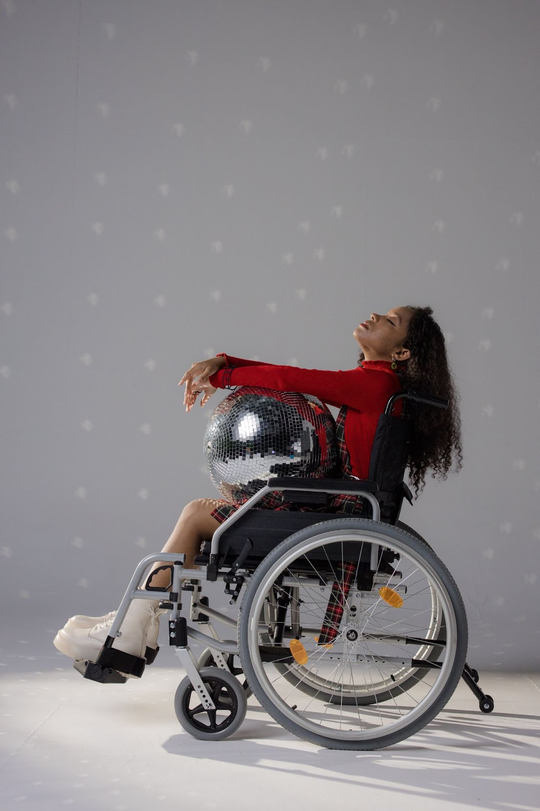
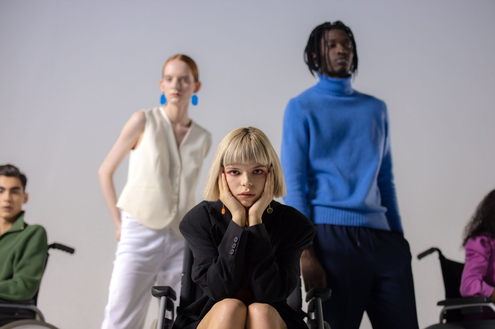

Clothing is a fundamental aspect of self-expression and identity, but for people with disabilities, illnesses, or injuries, it can be a daily struggle. Tasks as simple as fastening buttons or finding pants that fit over prosthetics can be incredibly challenging. [**Keah Brown**](https://keahbrown.com/), a writer with cerebral palsy, pointed out on the [_Wardrobe Crisis_ podcast](https://shows.acast.com/60ee3a8f1f9831001383bf3e/60ee3a9b89a35e0014893ea3) that people with disabilities often face not just physical barriers, but financial ones too.

Adaptive fashion, also known as accessible fashion or inclusive fashion, is changing the game by designing clothing that combines style and functionality.

## The Features of Adaptive Fashion

Adaptive fashion caters to individuals with disabilities, mobility difficulties, sensory issues, and those recovering from illnesses or injuries. It incorporates innovative features to make dressing easier and more comfortable. Here are some typical features:

- Magnetic buttons, zippers, and Velcro fastenings: These alternatives are designed for ease of use, particularly for individuals with limited hand dexterity. However, it's important to note that magnetic options may not be safe for people with pacemakers.
- Side openings on pants and shirts: These openings are convenient for both self-dressers and those who require assistance. They also offer easy access for medical procedures without the need to remove the entire garment.
- High-back pants: For wheelchair users, high-back pants provide adequate coverage even when sitting, avoiding discomfort and inconvenience.
- Care tags printed on clothing: Instead of tags that stick out, adaptive fashion opts for printed care instructions to ensure comfort for individuals with sensory issues.

## Beyond Functionality: The Need for Style

While adaptive fashion brings much-needed functionality, many clothing items lack style diversity. Often, adaptive clothing comes in simple cuts and colours, leaving little room for personal expression. However, many people with disabilities desire clothing that allows them to express their individuality and taste. Brands that successfully combine style and function could tap into a vast, underserved market.

## An Opportunity for Change

With the **World Health Organization** (WHO) anticipating [a rise in the number of people with disabilities](https://www.who.int/news-room/facts-in-pictures/detail/disabilities) due to aging populations and increasing chronic health conditions, the demand for adaptive fashion is set to grow. According to the [_2023 Adaptive Clothing Market Analysis Survey_](https://www.coherentmarketinsights.com/market-insight/adaptive-clothing-market-2294), the global adaptive fashion market was valued at nearly **\$1.36 billion USD in 2022**, with an expected compound annual growth rate (CAGR) of **6.7% from 2023 to 2030**. This growing market presents a significant opportunity for fashion brands to make an impact.

But the value of investing in accessibility extends beyond potential financial gains. Clothing is a powerful tool that can send messages and drive societal change. Unfortunately, the fashion industry often overlooks people with disabilities, whether through limited accessible clothing options or physical and financial barriers.

Physical and financial barriers, such as small changing rooms and elevated prices, still exist for in-store shoppers with disabilities. The cost of adaptive clothing, in particular, presents a major challenge for individuals disproportionately affected by poverty.

Moreover, meaningful representation of people with disabilities within the fashion industry is essential. Engaging people with disabilities in the design process ensures that products are not just functional but also presented effectively.

On-camera representation is another area that requires significant improvement, as many people with disabilities feel underrepresented and misunderstood in media.

## What next?

Fashion has a long journey ahead before we can truly call it accessible and inclusive. Mistakes may occur, but fashion brands of all sizes are making strides towards positive change. For fashion enthusiasts with disabilities, this progress cannot come soon enough.

> "Three decades after the passage of the landmark Americans With Disabilities Act, disabled people want to have the freedom of self-expression through fashion rather than accepting scraps from an industry that has been slow to embrace us and our needs."
>
> [Keah Brown](https://www.nytimes.com/2020/07/26/style/functional-fashion.html)

The adaptive fashion movement is working to break down these barriers, making fashion accessible and inclusive for everyone, regardless of their abilities. It's not just about clothing; it's about empowerment, self-expression, and a more inclusive world.
