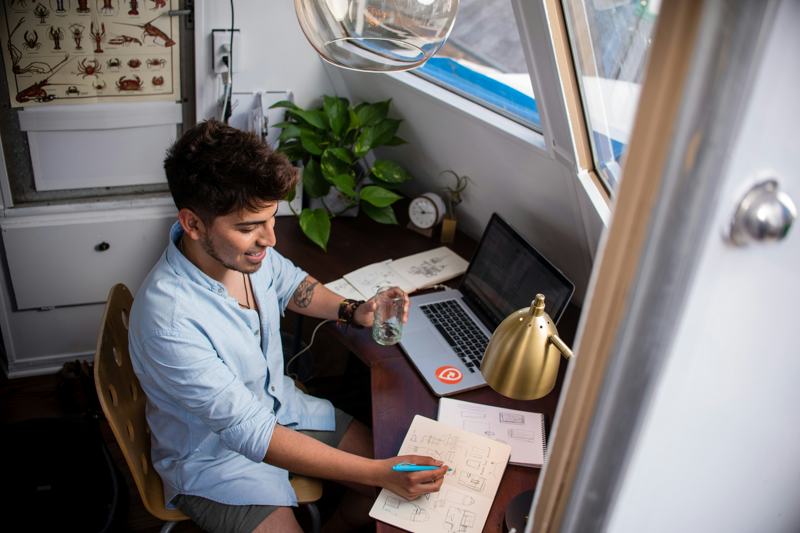

At Hey Nova, we're proud to be a remote-forever company. Our adaptable schedules and convenient work locations not only boost our productivity, but they provide major boosts in wellbeing.

[In a 2023 survey from the American Psychological Association](https://www.apa.org/pubs/reports/work-in-america/2023-workplace-health-well-being), 85% of hybrid workers and 89% of remote workers said they felt satisfied with their control over when, where, and how they worked, compared to 77% of in-person workers. More remote workers also reported feeling like they had enough flexibility to keep a healthy work/life balance (75% compared to 66% of in-person workers).

> Those who work in hybrid or remote arrangements were more likely to be satisfied with the how, when, and where they do their work (85% and 89%, respectively) than those who work in person (77%).
>
> ["2023 Work in America Survey" from the American Psychological Association](https://www.apa.org/pubs/reports/work-in-america/2023-workplace-health-well-being)

Any place where you spend a majority of your waking hours is bound to impact your mental health. With benefits like more time for loved ones and a routine of your choice, a remote job can unlock huge brain benefits. So, how can we maximize the benefits and stay mentally well both during and outside of work?

To figure that out, let's start by taking stock of remote work's strengths.

## Flexibility

A flexible schedule is one of the biggest benefits drawing people to remote work. Instead of struggling to fit your life around a standard 9-5 schedule, many remote jobs let you work when you choose. You can customize your hours based on your energy levels and your other commitments, reducing the stress of conflicting schedules. Your break times are yours to choose and rest is just a room away if you need it.

## More time for mental-health improving activities

Commuting to work can be a major time sink, especially in busy areas with major traffic. While remote employees might choose a co-working space or a secondary work location, they always have the choice to cut the commute entirely and work from home. This leaves more time for wellness management activities like:

- Getting enough sleep
- Taking breaks during work sessions
- Short breathing and mindfulness exercises
- Physical health activities like stretching, exercise, and cooking nourishing meals
- Time with family and friends

## Increased Comfort

With unspoken rules, body language expectations, and at times, confusing social etiquette, office jobs can get stressful, especially for workers who are neurodivergent or socially anxious. Virtual meetings and independent work spaces can ease the pressure to fit into typical in-person social norms.

Remote work can also reduce mental strain by letting everyone create the most comfortable and productive work environment for themselves. Music? No music? Working at your desk vs the kitchen table? Each worker is free to decide their best work environment for and change things up if it's not working.

## Best strategies for mental health and remote work

Remote work offers opportunities for mental health management that can be harder to come by in offices. Both workers and employers can benefit greatly from a happier, healthier team.

### Individual workers can try the following:

- Take at least a 10-minute break every hour to relax, re-energize, and come back to work refreshed.
- Consider sticking to a schedule for your working hours. This way, you won't have to spend mental energy wondering when to squeeze in your work hours. Plus, any coworkers you pass your schedule onto will know the best times to get a hold of you. You can always adjust for any surprise commitments or change your schedule if it doesn't work.
- If you prefer to work around people, consider co-working; you can rent an office space, meet up with a coworker or work with someone else in your life who works remotely
- If you choose to work mostly from home and you have the means to customize your space, go for it! This could be anything from hanging your favourite pictures to ergonomic office furniture that reduces stiffness. Creating a space tailored to your physical and mental needs will create a space that feels comfortable to work in long-term.
- Stay connected with family and friends during your free time.

### Remote employers can support their workers' mental health too:

- Let your employees know about any mental health benefits available to them.
- Encourage employees to use their breaks and vacation days to recharge
- Set up opportunities for employees to talk to each other both about work and their lives outside of work. Small, manageable moments of connection can combat loneliness, improve collaboration, and build team bonds without overburdening socially anxious or neurodivergent workers

With the right strategies, remote work can be a powerful tool for maintaining your work/life balance and your mental health. You can find more tips for managing a remote position on Hey Nova's Instagram and Facebook pages.

## Sources and further reading

- ["How Remote Work Can Impact Employees' Mental Health" from Forbes](https://www.forbes.com/sites/forbeshumanresourcescouncil/2023/07/03/how-remote-work-can-impact-employees-mental-health)
- ["The Impact of Remote Work on Mental Health: An In-depth Analysis" from ConnexOntario](https://www.connexontario.ca/en-ca/resource-hub/entryid/39/the-impact-of-remote-work-on-mental-health-an-in-depth-analysis)
- ["State Of Remote Work 2023" from Buffer](https://buffer.com/state-of-remote-work/2023)
- ["Our Epidemic of Loneliness and Isolation" from US Public Health Service](https://www.hhs.gov/sites/default/files/surgeon-general-social-connection-advisory.pdf)
- ["The workers keeping their disabilities secret" from BBC](https://www.bbc.com/worklife/article/20211101-the-workers-keeping-their-disabilities-secret)
- ["The parents who don't want to go back to the office" from BBC](https://www.bbc.com/worklife/article/20211007-the-parents-who-dont-want-to-go-back-to-the-office)
- ["Is remote work worse for wellbeing than people think?" from BBC](https://www.bbc.com/worklife/article/20220616-is-remote-work-worse-for-wellbeing-than-people-think)
