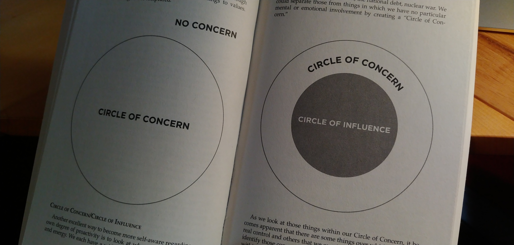
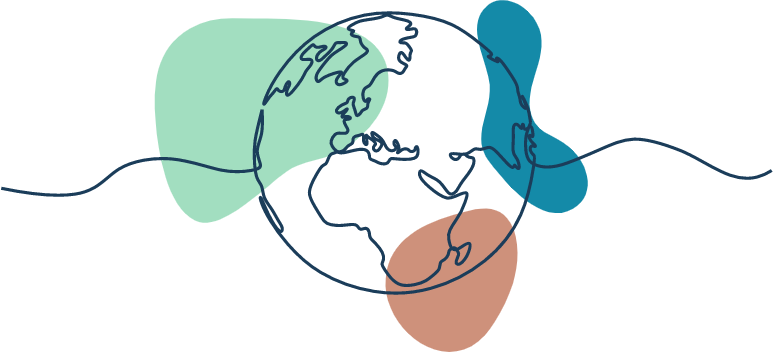

You have likely heard about the recent [Sixth Assessment Report from **Intergovernmental Panel on Climate Change** (**IPCC**)](https://www.ipcc.ch/report/ar6/wg1/), frequently called [the “code red for humanity”](https://www.un.org/press/en/2021/sgsm20847.doc.htm#:~:text=Today%27s%20IPCC%20Working%20Group%201,of%20people%20at%20immediate%20risk.&text=Greenhouse%E2%80%91gas%20concentrations%20are%20at%20record%20levels.) since its release. The report can be a lot to take in; however, the concentrated [“Summary for Policymakers”](https://www.ipcc.ch/report/ar6/wg1/downloads/report/IPCC_AR6_WGI_SPM.pdf) version is packed with the key points and findings, making it much easier to digest - and very much worth your time to read.

In short, the **IPCC** predicts the global temperature will rise more than 1.5°C by 2040 (or sooner) and warns that this will lead to more frequent and widespread extreme weather events - putting humanity and nature at higher risk. Despite all of this, the report offers some hope that rising temperatures can still be stabilised if there are serious cuts in emissions.

Unfortunately, [the coverage that has boiled over](https://www.theatlantic.com/science/archive/2021/08/latest-ipcc-report-catastrophe/619698/) since the report’s release has made [pessimism and lost hope](https://www.forbes.com/sites/jamesconca/2021/08/16/latest-ipcc-report-predicts-disasteryet-again-but-not-much-will-happenyet-again/?sh=247420f037b9) seem like perfectly sensible responses.

And that’s not even diving into the [out-sized impact climate change has on people with disabilities](https://www.ohchr.org/EN/Issues/HRAndClimateChange/Pages/PersonsWithDisabilities.aspx) around the world.

## What can _I_ do?

This is naturally a huge question for many of us. Countless groups and individual people [have taken a stab at answering that one](https://heated.world/p/what-can-i-do-anything), including [Canadian environmental icon David Suzuki](https://davidsuzuki.org/what-you-can-do/top-10-ways-can-stop-climate-change/), who has spent his career answering it for us. Others might ask “do my actions even make a difference?” - an easy thought to stumble into, given [the history behind the concept of an individual’s “carbon footprint”](https://www.theguardian.com/commentisfree/2021/aug/23/big-oil-coined-carbon-footprints-to-blame-us-for-their-greed-keep-them-on-the-hook) and personal responsibility.

When it comes to the big questions like this, it is helpful to consider what Stephen R. Covey called the “Circle of Concern” in his book, [“The 7 Habits of Highly Effective People”](https://www.goodreads.com/book/show/36072.The_7_Habits_of_Highly_Effective_People).

The basic idea is to understand what you can and (most importantly) can’t control in the world around you. Focus your main effort on the things you have immediate control over and let go of the parts you can’t directly impact. With a defined and focused circle of concern, your spread of influence (the wider ring around it) will ideally grow.

For those of us who make a living online - which let's face it involves a huge percentage of the population now, whether you work for an online service agency, manage an online store, require any form of research, and so on - we have the ability to make an exceptionally large impact on the world in our day-to-day livelihoods. Some of that impact can be good but some less so, considering that the web [generates an awful lot of carbon emissions](https://www.nature.com/articles/d41586-018-06610-y) around the globe.

> Research estimates that by 2025, the IT industry could use 20% of all electricity produced and emit up to 5.5% of the world’s carbon emissions. That’s more than most countries’ total emissions bar China, India and the US.
>
> [“The internet consumes extraordinary amounts of energy. Here’s how we can make it more sustainable” from The Conversation](https://theconversation.com/the-internet-consumes-extraordinary-amounts-of-energy-heres-how-we-can-make-it-more-sustainable-160639)

Should we give up all technology now and revert to the foraging lifestyle our ancestors thrived on up until adopting agriculture, roughly 12,000 years ago? I’m not one to yuck another’s yum, but a few of us dropping out of society won’t have much of an impact.

So, where do we start?

## Listen to your customers

Like accessibility and many other considerations when creating web sites and products, climate-consciousness needs to be a factor from the outset. This means getting to know your (or your client’s) customers!

Starting with analytics on an existing product, surveys or questionnaires where possible, and even phone or video interviews for more engaged customers, find out what they really need from you. This includes the device(s) they use, the internet connections they have, and the time they’d like to spend on your website, achieving their goals. You would be surprised how much time, money, and (most importantly!) carbon emissions this kind of customer profile can save you.

For instance, say your product is in the agricultural domain. From learning about your customers, you may find they typically have slow internet (which is the case in many rural areas), older computers or laptops, and interact with your software at the end of a lengthy day, when they’re tired and easily lost by fanciful designs and too many steps. You now know how to target the core of your users in the most effective and efficient way - without wasting extra screen time, bandwidth, or processor power!

[We’ve discussed the value of speaking with customers before, in the context of gathering insights](https://heynova.io/blog/how-anyone-can-gather-insights-for-web-accessibility/). It all comes back to building a better product!

## Start from the top

Knowing your customers will have an incredible impact on the end product, but nothing shapes a company’s decisions and culture quite like the people who lead it. If this is you: congratulations, you have absolute power in shaping a climate-friendly business.

First and foremost, before getting to know your end customers, get to know your clients. If your product or business serves other businesses, pay attention. [Canadian banking companies have regularly come under fire](https://www.cbc.ca/news/business/canada-banks-fossil-fuels-report-1.5960845) for eagerly funding fossil fuel companies operating in Alberta’s oil sands. Global [online retailers face sustained pressure for their emissions](https://www.nbcnews.com/tech/tech-news/amazon-shareholders-demand-end-pollution-hitting-people-color-hardest-n1268413) and outsized impact on minority populations. Tech companies as an industry [are responsible for consuming massive amounts of power](https://www.newstatesman.com/spotlight/2020/11/big-techs-carbon-problem) to keep data centres alive and running. None of these are great reputations for you or your clients when trying to become an environmentally responsible organization.

When building your company’s culture, the balance of remote or in-office work will have an impact on your climate-friendliness. Having employees who work from home [has the unintended impact of shifting your company’s carbon impact onto each employee’s home office](https://earth.org/what-is-the-climate-impact-of-remote-work-policies/), but the reduction in car commuting may very well be worth it - as well as opening up your organization to people with mobility restrictions or budgets which make commuting difficult. If working in an office makes the most sense for some of your team, consider subsidies for transit passes or budgets to offset the cost of cycling gear.

> When assessing these trade-offs, geography matters. The data analytics company ENGIE Impact [suggested](https://www.engieimpact.com/insights/carbon-impact-remote-work) that if car commuting is already the status quo for employees at a given office, “a reduction in commuting is the most reliable way to reduce carbon — even after factoring in the potential for increased energy use in a WFH environment.”
>
> [“The Environmental Implications of the Return to the Office” from Bloomberg](https://www.bloomberg.com/news/articles/2021-03-29/is-telecommuting-really-greener-it-depends)

Outfitting the office can offer many opportunities to take power usage seriously. Opting for laptops for your team to use, rather than power-hogging desktop and monitor setups, can have a major impact. Sticking with the tried-and-tested coffee pot instead of the one-off coffee machines will do wonders in cutting your office waste. If you regularly stock snacks, condiments, and other food options for your team, try steering away from single-use packaging, cutlery, or dishes.

Don’t be afraid to get creative either. Your team is likely filled to the brim with ideas to help out, so listen to them! Offering a single (paid) volunteer day per employee per year may be enough to help them get started on their particular journey - whether it is focused on climate change or another important cause.

[We’ve previously explored the importance of listening to your team when navigating the rush back to “normal”](https://heynova.io/blog/can-normal-include-everyone/). It pays to get their perspective!

<blockquote class="twitter-tweet">
The biggest thing I learned? Listen to your damn employees. Never assume you know what&#39;s going on - never make top-down decisions without their input.  We hold weekly company meetings with everyone invited and have multiple reps from each team vote on our priorities each year.
&mdash; Dan Price (@DanPriceSeattle) <a href="https://twitter.com/DanPriceSeattle/status/1420842812443070465?ref_src=twsrc%5Etfw">July 29, 2021</a></blockquote> 

## Lost in the details

While customers, clients, and leadership can have a massive impact on delivering climate-conscious online experiences, the people planning, designing, building, testing, and hosting the end product have an even larger footprint over the lifetime of online content. Check in next time when we look closer at the choices you can make as an individual or team working to create products for the web.

We know that climate change is a heavy topic, with rising fear over the state of the world. If you are feeling overwhelmed and anxious, visit **[Eco-Anxious Stories](https://www.ecoanxious.ca/)** for a kind and caring community of people who feel the same and are there to support you. Let’s not give up hope and instead work together to change the state of the planet.
