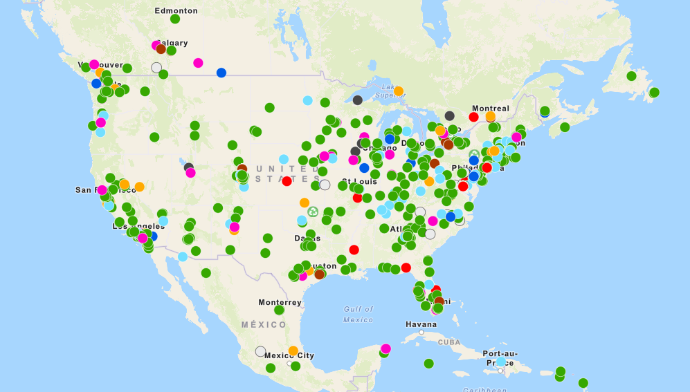
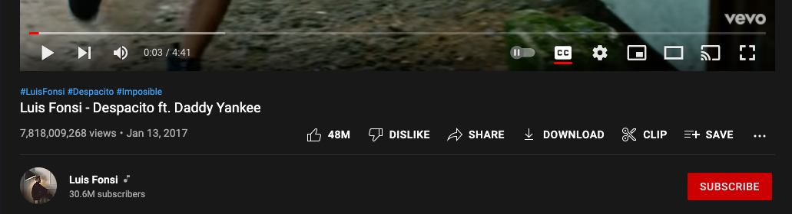
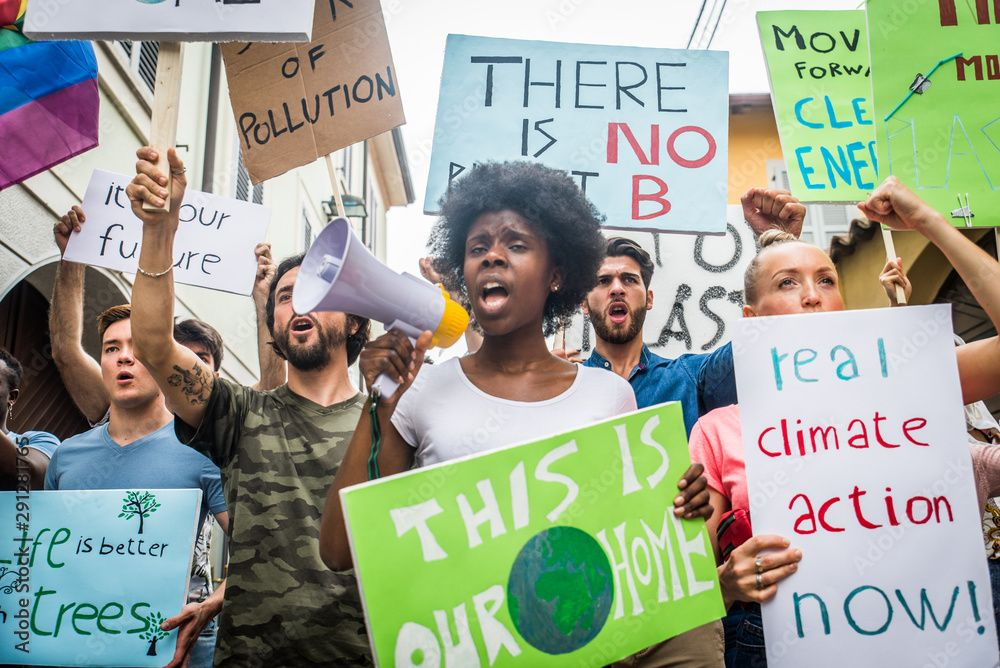

Another turn of the sun, and **Earth Day** is here again, carrying with it a reminder that is hard to ignore. The [very first **Earth Day**](https://www.earthday.org/history/) kicked off on April 22nd, 1970. Since its fruition 52 years ago, the annual event has grown massively, and is now recognized and celebrated around the globe, with [green initiatives and environmentally-friendly activities happening everywhere](https://www.earthday.org/earth-day-2022/). Perhaps you and your colleagues, friends, or family have something planned for the day?

Beginning in August of 2021, [**The Intergovernmental Panel on Climate Change**](https://www.ipcc.ch) (**IPCC**) kicked off their comprehensive **Sixth Assessment Report**, with a first part focused on the [“most up-to-date physical understanding of the climate system and climate change”](https://www.ipcc.ch/report/sixth-assessment-report-working-group-i/) around the globe. In early April this year, the third piece of the report was released, this time dissecting [“climate change mitigation progress and pledges”](https://www.ipcc.ch/report/sixth-assessment-report-working-group-3/) and its effectiveness around the world. In other words, just in time for **Earth Day**, the **IPCC** has gifted us with a careful examination of the steps we can take and those already taken to reduce our impact on the globe!

More than ever, as a global community we are recognizing the importance of reducing the environmental impacts of humanity - our consumption, production, technological advancement, and everything else. While it can be easy to [lose faith in our species’ willingness to make better choices](https://www.nytimes.com/2021/07/23/well/mind/mental-health-climate-anxiety.html), we can still focus on the ones which each of us face directly.

And what better time to focus on it than the day we’ve set aside to celebrate the only home we have; Earth!

## Taking action

In [part 1 of this conversation](https://heynova.io/blog/building-a-climate-friendly-web-part-1/), we looked at ways that companies or team leaders could have a positive impact on their carbon footprint. Now, we’re focusing on the people within those teams and working for those organizations - specifically web-based products. We’re talking about product managers, designers, engineers, and anyone else who puts together online products and content.

We work in teams, alongside one another, where our choices influence and impact others as much as theirs do us - especially for larger, global online products, [where millions of users and billions of visits can really add up](https://www.aljazeera.com/economy/2020/2/28/emissions-possible-streaming-music-swells-carbon-footprints)!

 for the top streaming services in 2022: https://www.businessofapps.com/data/video-streaming-app-market/")

Let's look at some actions that these roles in the workplace can take in order to strive for a more sustainable and environmentally-friendly tech industry.

### Project management and product design

This layer of online production is the earliest and potentially most impactful group to begin shaping a climate-friendly approach for the rest of the team. From the preliminary stages of gathering requirements and identifying the problem space, this group’s choices set the tone.

Consider some options for reducing the project’s footprint from the get-go:

- Do meetings need to be in person? How many commutes will need to happen for something that could possibly be done remotely?
- For in-person meetings, are we generating waste from sticky notes, crumpled paper, coffee cups, and individual snack wrappers? What steps can we take to reduce this?
- How many people are involved in each remote planning and sync session? Can the large group of muted, passive participants be left off the invite and caught up with a summary email?
- How much of that brainstorming and ideation needs to happen live and in the moment? Could we reduce the bandwidth and power usage by providing a project brief and setting a timeline for thoughts, questions, and ideas to be collected from the group?

As a project takes shape, this group holds all the power in keeping things focused on the key problem(s) to be solved. A project’s solutioning and scope grows organically from the size of the problem - so a smaller, cleaner focus will lead to a more concise and manageable project. The better understood the problem space is from the early stages, the lower the likelihood of large, costly, resource-intensive changes down the line, once the rest of the team is more heavily involved.

### Branding, visual design, and content creation

With a clean, concise problem defined, we move over to the folks who sketch out the path to solving it. So many decisions are made during this phase of a project that will have a massive effect on our web product’s environmental impact.

Some considerations while working through the problem and starting to build a visual solution can be:

- Keep large images and video files targeted and intentional, rather than splashing them all throughout the product experience
- Device processing and power consumption climbs rapidly with every complex visual pattern, vast colour palette, and lengthy animation in-browser
- Massive icon sets and multiple custom fonts will lead to more and larger libraries needing to be stored, served, and downloaded by every user on each visit

You don’t have to avoid all the fun visual and content elements entirely! Like the previous section, however, it pays to know your audience and their problem in order to keep focused on your solution. A sprinkle of animation, a simple new colour or font element, or a single large, splashy image can go a long way in drawing your users’ attention where you want it to be. Testing concepts along the way will help put proof in front of stakeholders who may be asking for bigger, brighter, and more “wow factor”.

<!--
  Find this image on Adobe Stock for purchase:
  https://stock.adobe.com/ca/images/website-designer-planning-application-development-draft-template-layout-framework-and-coding-program-on-paper-and-computer/264179865?prev_url=detail
  -->

When it comes to crafting an easy-to-understand user experience and clear, helpful content, the same focus on your audience will help:

- Ensure the primary action is easy to find and engage with - less time spent looking for an answer means less power consumed by the user’s device
- Instructions, requirements, and feedback should be up-front and help avoid any confusion or missteps. A form that frequently throws errors with hard-to-understand instructions will mean more server requests, browser rendering, and time the user spends online
- Focus on honest and accurate marketing and SEO to ensure that users who land on your product or website will stick around and find the answer they’re looking for, rather than leaving immediately to visit other sources

Hopefully, you’re starting to see the tight correlation between [best-practices, accessibility, clarity, and carbon footprint](https://sustainablewebdesign.org/category/marketing/)! **What’s good for your users is great for your product and, ultimately, your environmental impact.**

### Engineering and technical infrastructure

If your product leadership and designers have been keeping focused on solving the key problems, the teams who implement the feature will be much more effective in building the best solution. The more information available on the end-users and the context of the problem, the closer your engineers can come to implementing it for the right device, screen size, and connection speed.

Front end (and full-stack) developers, who build what you can see and interact with, will have the most immediately visible options for reducing your product’s environmental impact. This includes:

- Building a semantic, standards-based, and accessible user interface will ensure users can consume and digest your content quickly and accurately - consider [the four principles of accessibility](https://www.w3.org/TR/UNDERSTANDING-WCAG20/intro.html#introduction-fourprincs-head) when implementing your product’s front end
- Compressing and minimizing files and assets to reduce network requests and load times
- Benchmarking and testing browser (or native app) performance while downloading, rendering, and updating content will help you track and set clear goals
- Performance-tuning animation, interaction, and front-end framework rendering will reduce browser repainting, update cycles, and server requests that all consume power and take time to load and render

These all seem like such small things, but on a large product with hundreds or thousands of visits per hour, [this stuff adds up](https://www.forbes.com/sites/hughmcintyre/2019/07/16/despacito-is-the-first-song-to-hit-one-billion-streams-on-spotify-twice/?sh=544eab475d1e)!

While much of the front-end team’s success will come from close collaboration with designers, the back-end and dev-ops teams have a big impact behind the scenes. Infrastructure plays a key role in this area with database design, file storage limits, and caching and purging strategies all influencing the time it takes for users to reach and consume the product’s content:

- Consider your options when designing a database solution to meet the product’s needs - will flexibility be the key, or will it best scale in a stable, relational environment?
- Establish and document API contracts to make clear where to fetch which data and how to best render a page with a balance of fewer requests with faster response times
- Leverage task queues, background processes, and scheduled actions to help reduce or offset the power consumed on the server-side and the amount of waiting time for the end-user
- Work with the front end team to establish expectations and methods around cache-busting, socket requests, and other conditional approaches to help give the users enough guidance to complete their goals while waiting for the more intensive processes to happen in the background

Beyond the application itself, consider the choice of servers, hosting, and any scaling infrastructure. Geographic location will play a role in speed, but seeking out an environmentally-conscious provider can make for [an incredible reduction in your product’s carbon footprint](https://www.fastcompany.com/3028771/where-does-the-internet-get-its-energy-tech-companies-power-sources-visualized). Whether they operate using renewable power sources, buy carbon offsets, or use other technology to reduce consumption and emissions, it is well worth [the research to find the right partner](https://www.websitebuilderexpert.com/web-hosting/green/).

## Thinking big picture

One important lesson that sticks out after years of advocating and pushing for accessibility across various digital agencies and products is the value of being an activist. Activism is much more than showing up to protests with handmade signs! So much of the work comes in the form of pushing yourself to learn and grow while keeping pressure on the powers around you. For political matters, this means our elected representatives. Within a company, this means management and leadership.

<!--
  Find this image on Adobe Stock for purchase:
  https://stock.adobe.com/ca/images/activists-demonstrating-against-global-warming/291281765?prev_url=detail

  This is the same image used as the post's thumbnail.
  -->

We’ve outlined some of the steps you can take as a member of the team to make your own work more environmentally friendly, but what can you do to effect change at a company or product level?

- Operate as [a community organizer](https://en.wikipedia.org/wiki/Community_organizing) within your team, by assembling and mobilizing other activists - many people care about their environmental impact, but may not be aware that they can make a difference at work
- Request that your leadership provide a carbon emissions report for the company and push to get a timeline and commitment on reduction
- Suggest carbon offset options for company meetings and events - [many airlines and third-party organizations offer this](https://davidsuzuki.org/science-learning-centre-article/purchasing-carbon-offsets-a-guide-for-canadian-consumers-businesses-and-organizations/) and your leadership may not be aware of it
- Demand accountability by asking follow-up questions or requesting updates of your company’s carbon plans during town-halls or company-wide events - if leadership is making progress, they will be happy to share this news with your team!
- Listen to your fellow activists! The people around you undoubtedly have great ideas, especially in a workplace where they may be looking for a creative or problem-solving outlet

## Looking forward

One of the most important aspects of making a difference in the company and community around you is to keep learning and never take any work environment as permanent! From the **Earth Day** website:

> In the decades leading up to the first Earth Day, Americans were consuming vast amounts of leaded gas through massive and inefficient automobiles. Industry belched out smoke and sludge with little fear of the consequences from either the law or bad press. Air pollution was commonly accepted as the smell of prosperity.
>
> [Origins of Earth Day](https://www.earthday.org/history/)

Web-based products and companies today can be considered much the same as the industry of pre-1970s America (and any other developed nation around the world). We consume power, both directly, through our infrastructure, and by our users, and generate waste at an incredible rate - but this _can_ (and constantly _does_) change! If you’d like to keep that push going and continue learning, here are some helpful resources:

- [“Rules for Radicals” by Saul Alinsky](https://www.penguinrandomhouse.com/books/2085/rules-for-radicals-by-saul-alinsky/)
- [“Sustainable Web Design” by Tom Greenwood](https://abookapart.com/products/sustainable-web-design)
- [“Designing for Sustainability” by Tim Frick](https://www.oreilly.com/library/view/designing-for-sustainability/9781491935767/)
- [Sustainable Web Design (website)](https://sustainablewebdesign.org)
- [Website Carbon Calculator (website)](https://www.websitecarbon.com)
- [“What are carbon offsets and how can they be used?” by Clean Energy Canada](https://cleanenergycanada.org/media-brief-carbon-offsets-what-are-they-and-how-can-they-be-used/)
