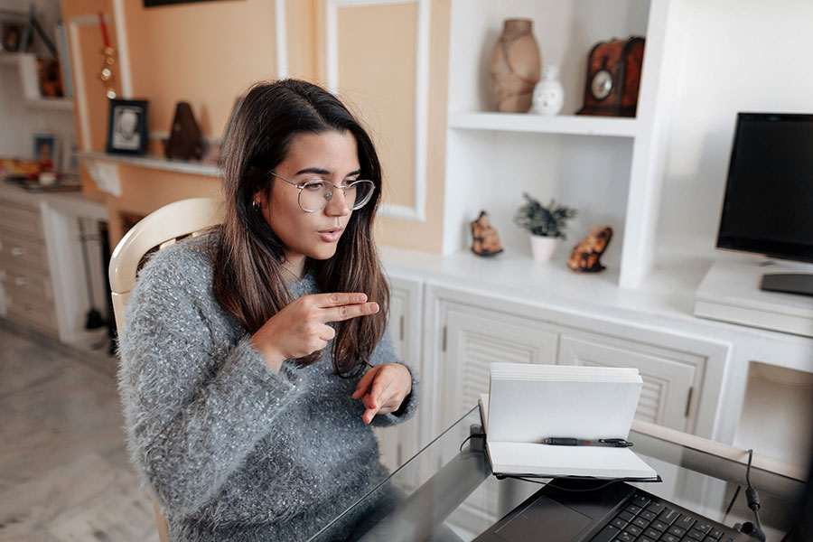

Lock-downs, stay-at-home orders, remote work, curbside pickup, online ordering, video calls, social distancing - these are all concepts the world has collectively grown both accustomed to and often tired of since early 2020. Schools, public services, businesses, workplaces, and more either shut down or made drastic adjustments in those early months in an attempt to reduce risk and stop the virus from spreading. Much of the media and public conversation at the time focused on how long it would last and [when we could return to “normal”](https://www.forbes.com/sites/jemimamcevoy/2020/12/06/life-will-start-getting-back-to-normal-in-april-or-may-operation-warp-speed-head-projects/?sh=21e9078f1a12).

We’re now in the latter half of 2021 and for many of us, “normal” seems like a pretty strange concept. For the [over six-million Canadians (roughly 22% of our population) with disabilities](https://www.canada.ca/en/employment-social-development/programs/accessible-canada.html), the thought of returning to “normal” can be downright depressing.

## “Normal” doesn’t always mean “good”

For many people who had attempted to secure remote work accommodation prior to the pandemic, the [answer was generally a “no”](https://www.teenvogue.com/story/disabled-people-react-to-coronavirus-work-from-home-accommodations). This result was the same for [professional conferences, education, and other services worldwide](https://www.cnet.com/health/the-covid-19-crisis-highlights-how-far-accessibility-still-has-to-go/). People with disabilities have routinely been shown that they are [“too much effort to bother to include”](https://www.teenvogue.com/story/disabled-people-react-to-coronavirus-work-from-home-accommodations#:~:text=that%20it's%20too%20much%20effort%20to%20bother%20to%20include%20us).

> Many of us have long asked, fought for, and have been denied these reasonable accommodations, and have even lost their job as a result. So, it can feel painful to watch policies we’ve been told were impossibilities, unfair work arrangements, or somehow detrimental to the energy of the workplace, be so widely and effortlessly implemented.
>
> ["Disabled People React to Coronavirus Work From Home Accommodations" from Teen Vogue](https://www.teenvogue.com/story/disabled-people-react-to-coronavirus-work-from-home-accommodations)

With COVID-19 rampaging around the globe, “no” was no longer an option. Seemingly overnight, longstanding attitudes toward at-home productivity were forced to sit back and embrace the circumstances. This went for similar previous assumptions as well, such as [video games and screen time for children](https://www.unicef.org/globalinsight/stories/rethinking-screen-time-time-covid-19).

In many cases, remote work and other pandemic-driven adjustments have lead us collectively to better accommodate people with disabilities. For some advocates, the injustice of only having accommodation granted when everyone needed it is yet another reminder of the discriminatory treatment that many deal with every day.

> Lucy Greco, a web accessibility evangelist at the University of California, Berkeley, who is blind, notes [accommodations] weren't put in place to help people like her who'd long asked for these measures. "[Working from home] wasn't given to us as an accommodation," Greco said. "It was given to us because everybody else had it."
>
> [“COVID-19 showed digital accessibility is critical. Advocates don't want you to forget” from CNET](https://www.cnet.com/tech/mobile/covid-19-showed-digital-accessibility-is-critical-advocates-dont-want-you-to-forget/)

## Moving ahead with the right intentions

The right intent matters, as the CNET article above points out. The jump into remote work and other online changes may have come from the demands of the pandemic - but that does not mean the world needs to abandon all of our modifications when things clear up (if they do).

Outside of the workplace, we’ve all made life adjustments to avoid spreading the virus over the past months. For some of us, the shift to online food-ordering, grocery pickup, and other curbside services was a relief. While the initial rollout and lock-down restrictions were frustrating, the expansion of service options is something many of us had been waiting for. For others who may have never used an online service, this change has been substantial - and either a helpful new tool, or a confusing and stressful barrier. This is especially impactful for much of the [18% of Canadians over the age of 65](https://www150.statcan.gc.ca/n1/daily-quotidien/200929/dq200929b-eng.htm).

> For individuals on the wrong side of the so-called “gray digital divide,” in the absence of the pandemic, online grocery shopping may never have received a second thought. Instead, it became a matter of necessity almost overnight.
>
> [“Covid Reminds Us That Web Accessibility Helps All Users, Not Just [Persons with Disabilities]” from Forbes](https://www.forbes.com/sites/gusalexiou/2020/08/23/covid-reminds-us-that-web-accessibility-helps-all-users-not-just-the-disabled/?sh=8ac48106df14)

Learning new technology, rewriting habits, and embracing change can be tough for some. The benefits of these shifts, however, are absolutely worth keeping in place for customers who have difficulty getting to a restaurant, store, or other business. Whether due to mental or physical challenges, limited public transit, or other constraints, many people will continue to have the opportunity to order items online and have them shipped, delivered by the store, or prepared for curbside pickup.

Many restaurants, packed with high-touch surfaces, jumped to [smartphone-friendly options, such as QR codes](https://www.esquire.com/food-drink/restaurants/a36875447/qr-code-menus-restaurants-permanent/) in order to keep their staff and patrons safe. Users with low vision, learning disabilities, vision impairments, or any number of other experiences, can potentially access a menu on their device of choice, with their screen reader, colour filter, zoom level, or other assistive tools, to help navigate the limited world of paper menus.

For business owners, leadership teams, and managers, consider the positives that have come for your staff, if they’ve been working from home. The flexibility of hours, stress-reduction from no commute, cost-savings from coffee and food at home, increased time for friends, family, and hobbies is a plus many people would be hesitant to give up. Add to that the reduction in stress and struggle for employees (current or prospective) with physical disabilities, mental illness, appointments with care providers and specialists, children or other dependents at home, and your company has the potential to be a more diverse, inclusive, and successful workplace.

## Setting the “new normal”

If we take nothing else away from the impact these pandemic changes have made for many people, especially those with disabilities, we must consider a more inclusive and considerate path forward. For a team working remotely, spend the time to ask everyone what they’d like to keep and [how they see the future](https://www.fastcompany.com/90593744/the-office-as-we-know-it-is-over-and-thats-a-good-thing). Whether your workplace returns completely to an office, maintains an entirely remote culture, or strikes a balance between the two, ensure that your people are part of the decision.

Restaurants, bars, stores, and public spaces which have made adjustments for social distancing, capacity limits, cleaning high-touch surfaces, limiting contact, etc. should speak with their staff and customers to find out what works best. Bar and restaurant owners will (understandably) want their businesses back to full capacity, but this may not suit the customers - both long-time and newfound - who have grown to enjoy the extra space for a wheelchair at the table or a clearer pathway to the washroom.

If the rush back to “normal” leaves people, especially those with disabilities, back out in the cold, we will have spent this entire global experience not learning, growing, or embracing the change.

To wind down, I’d like to borrow a few words from Jennison Asuncion, co-founder of [Global Accessibility Awareness Day](https://globalaccessibilityawarenessday.org/) (GAAD) and Vice-Chair of the [GAAD Foundation](https://gaad.foundation/), as he was quoted while speaking with CNET:

> Despite the obstacles, Asuncion said he's hopeful the pandemic has illuminated how much can be accomplished when companies are dedicated to democratizing digital access. "I have faith in the community of people with disabilities that we will not settle for the way things were," he said, "because we know what's possible."
>
> [“COVID-19 showed digital accessibility is critical. Advocates don't want you to forget” from CNET](https://www.cnet.com/tech/mobile/covid-19-showed-digital-accessibility-is-critical-advocates-dont-want-you-to-forget/)

")
