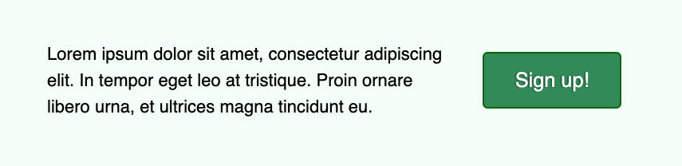

If you work with the web, marketing, or any number of other fields which involve the written (or spoken, or performed) word, you’ve likely heard the adage, “content is king.” The phrase has been widely attributed to Bill Gates, from [a 1996 essay outlining his thoughts](http://web.archive.org/web/20010126005200/http://www.microsoft.com/billgates/columns/1996essay/essay960103.asp) on where online content, advertising, and payment was heading. [Other sources point to Sumner Redstone](https://en.wikipedia.org/wiki/Sumner_Redstone#:~:text=Redstone%20coined%20the%20phrase,%20%22Content%20is%20king!%22) for coming up with the idea. Either way, it is a well-trodden truism by the time of writing this in 2021.

> “One of the exciting things about the Internet is that anyone with a PC and a modem can publish whatever content they can create. In a sense, the Internet is the multimedia equivalent of the photocopier. It allows material to be duplicated at low cost, no matter the size of the audience.”
>
> [From “Content is King” by Bill Gates](http://web.archive.org/web/20010126005200/http://www.microsoft.com/billgates/columns/1996essay/essay960103.asp)

## Big ideas and small words

The content spoken so highly of in Gates’ piece is generally the “big idea” type of writing. This is the meat of most web content - press releases, short stories, editorials, news articles, blog posts (like this!), and even social media posts. The stuff where Gates “expect[ed] much of the real money [would] be made on the Internet,” primarily through advertising or subscription revenue.

There is another branch of web content, however, which is much more frequently overlooked and under-attended - but by no means less important!

“Microcopy” describes the [small words and phrases which bring an interface together](https://uxplanet.org/microcopy-tiny-words-with-a-huge-ux-impact-90140acc6e42). Think of form labels, button and link text, error messages, newsletter checkboxes, etc. These are tiny words with a big impact. [Microcopy matters](https://www.shopify.ca/partners/blog/microcopy-why-tiny-words-matter)!

> “At a glance, these tiny clusters of words seem insignificant when compared to major elements of design. But don’t judge microcopy on its size, judge it on its effectiveness.”
>
> [From “Microcopy: Why Tiny Words Matter” on the Shopify blog](https://www.shopify.ca/partners/blog/microcopy-why-tiny-words-matter)

These tiny words can help your visitors and customers navigate through your website, sign up for a service, troubleshoot an error, and even get a sense of your brand - whether playful and light, or serious and straight-to-the-point.

[example image of copy tone]

## Little words with a large job

While you’re putting thought into the little words that live throughout your website, don’t forget about how they might reach a larger audience. Consider your users who may be navigating with a screen reader or other assistive technology. Look out for the people using a mobile device or a browser with text zoomed-in to 200%. Take an extra moment to write with low contrast or colour-blindness in mind.

How do these scenarios impact your microcopy?

Take the example image above. If your copy in the left column is written in something other than Latin and you want users to reach for that button to the right, you might say something like:

> “Click the green button on the right.”

Fair enough. What about the user who is on a small screen? Or a large screen with the text zoomed in? How would that call-to-action read with the side-by-side columns stacked to a single one? You may be tempted to say “click the green button below”, but that leaves out our original target of folks with a large screen and zoom level at 100%.

And what should we say for users without a mouse? What if they’re on a touchscreen device? Personally, I use a track-pad for my work and home computers, as a mouse leaves my wrist sore after a day of sustained use. Should we say “tap” instead of “click”? What happens to our visitors who are using a mouse, or others using a screen reader and keyboard?

Finally, we come to the colour descriptor: “green”. Obviously, this won’t be great for folks with [deuteranomaly, the most common form of colour-blindness](https://www.colourblindawareness.org/colour-blindness/types-of-colour-blindness/). Additionally, it doesn’t help visually impaired users, navigating with a screen reader and keyboard. To use another personal example, I set my [Android phone to switch to grayscale](https://ting.com/blog/going-grayscale-ios-android-smartphone/) when charging, to remind me to put it down and go to bed. You might be surprised at how confusing the internet can be without colour!

Many of these examples are covered by the **Web Content Accessibility Guidelines** (**WCAG**) in [success criteria **1.3.3 - Sensory Characteristics** (Level A)](https://www.w3.org/TR/UNDERSTANDING-WCAG20/content-structure-separation-understanding.html).

Does this mean we can’t use terms like left, right, top, bottom, green, blue, click, tap, etc.? No. Not at all. In fact, the use of [multiple sensory descriptors is encouraged](https://www.wuhcag.com/sensory-characteristics/#:~:text=Good%20instruction%20will%20use%20several%20sensory%20characteristics). We just need to be sure that we are providing additional context for people who do not have access to some of the senses we might default toward. For example, our original call-to-action could be phrased more inclusively, like:

> “Hit the big, green ‘Sign up’ button to receive our weekly newsletter.”

We’re telling users to “hit” the button, which doesn’t assume an input method (you could also use “select” if your copy personality is more formal), we’re offering the button’s label text to help users listening to a screen reader’s interpretation, and we’re still offering some visual cues with “big” and “green”.

As a bonus, we’re also providing some expectations for what will happen when the user follows our call-to-action.

## When tiny words are too small

Adding to our last point about setting user expectations, our link and button microcopy has another important job when it comes to accessibility. [**WCAG 2.4.4 - Link Purpose (In Context)** (Level A)](https://www.w3.org/WAI/WCAG21/Understanding/link-purpose-in-context.html) gives a lot of detail for a simple concept: tell your visitors where a link is taking them.

[example image]

Take a look around at any number of news publications, blogs, or social media sites and watch for the proliferation of “read more”, “click here”, and “show all”. If you don’t already, try using your Tab key to navigate through one of these pages and guess each link’s destination based on its label text alone. If you navigate by screen reader, this is a constant experience.

Many websites solve this by linking an article’s heading. Some link the heading and summary text as well. Both of these options offer far more context to the user who is deciding whether or not they want to “read more” - and neither require extra effort from your microcopywriter!

## Words matter

Your website’s content matters. Whether you’re providing a service, offering assistance, or just sharing knowledge, your visitors need to be able to get around your site. The big content may represent the monarchy, but the little stuff is the day-to-day governance, keeping your users on track and happy to engage.
