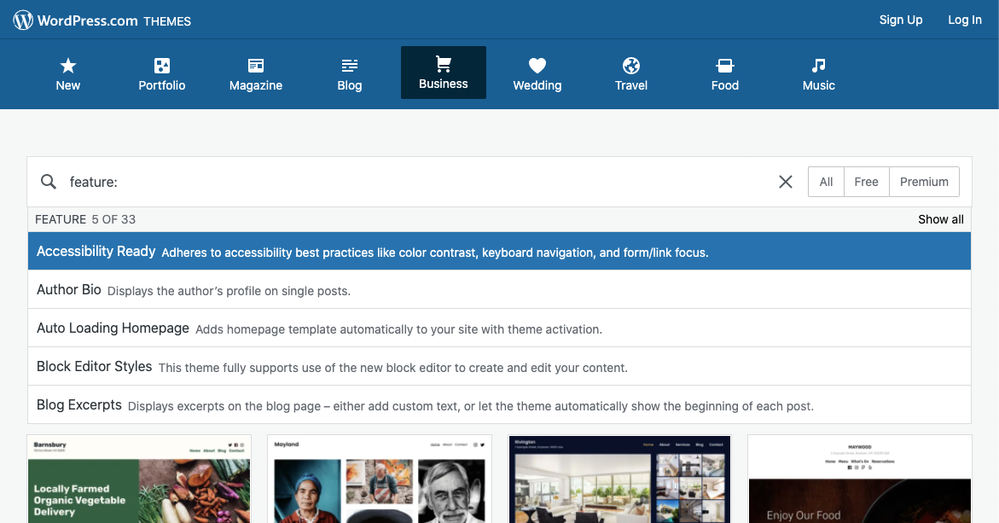
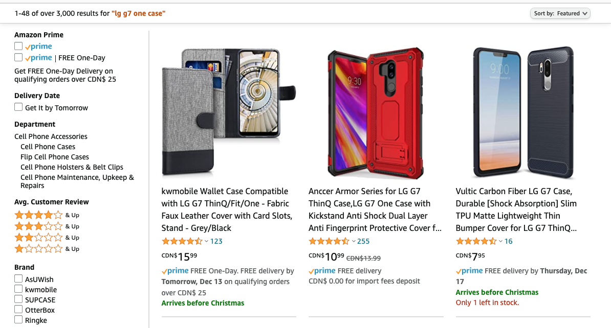

We are well into December now and the biggest shopping season of every year. Combine this with 2020’s unique challenges and we are looking at a [surge of online commerce that is more than double of a typical year](https://www.cnbc.com/2020/10/28/online-holiday-sales-to-surge-33percent-to-189-billion-adobe.html).

With this spike in traffic comes an [increased rate of first-time online shoppers](https://www.cpapracticeadvisor.com/small-business/news/21140614/coronavirus-results-in-increase-in-firsttime-online-shoppers). Many of these new digital customers may struggle with navigating online due to a lack of support for any number of disabilities or situations. Consider a grand-parent, browsing a major online retailer for the first time, searching for a nice gift for their grand-child. Or a young, tech-savvy, fiercely local business supporter, navigating the massive variety of ecommerce experiences on offer from their neighbourhood favourites. The range of experience, understanding, and potential for encountering barriers has gone way up with the swell of 2020 online shoppers.

<!--
  Use this one for the post image too!
  Source on Adobe Stock:
  https://stock.adobe.com/ca/images/asian-senior-man-looking-confuse-when-using-credit-card-for-online-shopping/280246296?prev_url=detail
  -->

What can you, as a business owner, someone running an online store, or someone looking for ecommerce platform options, do to help out? Whether you are trying out a new service or you are embedded in an existing platform, here are some tips to keep your customers’ online experience accessible, inclusive, and successful!

_**Note:** many of these will vary, depending on the level of control you have over the design and implementation of an online shopping provider you are using. The tips below include as many broad and available-to-anyone options as possible, with some added extras for more customisable ecommerce platforms_

## Consider the keyboard and screen reader experience

We’ve walked through [testing with keyboard and screen readers before](/blog/how-anyone-can-start-testing-for-web-accessibility/). This is the perfect time to put your findings to good use! Remember that customers browsing with a keyboard and screen reader will not necessarily have imparied vision. People with colour blindness, vestibular disorder, concussion symptoms, dyslexia, or difficulty reading (whether from a learning disability or unfamiliarity with the language) may also use these tools to help navigate the web.

Many ecommerce services will offer some or all of the following options:

- Including **alternative text** (or "alt text") to describe product imagery for people using a screen reader or with slower internet connections

- **Contrasting colour** choices to help separate text from the background for users with colour blindness, low vision, or in an environment with heavy reflections on their screen (use an online tool like [WebAIM’s contrast checker](https://webaim.org/resources/contrastchecker/) to help with this)

- Lists, underlines, bold, and italicised **text formatting** to call out important parts of product descriptions for customers who may struggle with long-form written content

- **Iconography** to support and reinforce (not replace!) intent and messaging can help people who have difficulty with reading comprehension

- **Meaningful labels**, descriptions, and error text attached to form fields will help all customers to know what is being asked

- Clearly differentiating **required and optional fields** helps reduce confusion and uncertainty, especially for people in a rush or less comfortable with online shopping

Take a look through your shopping platform’s settings to see what other options are available to help your customers navigate your store. Some will offer less common or even experimental features which can benefit visitors and increase the conversion to customers!

If your ecommerce platform allows themes to be purchased and installed, you may find multiple options with accessibility improvements baked-in! Many services will offer an accessibility-related filter when searching for themes and plugins to help narrow your results. For example, **WordPress** offers "Accessibility Ready" as their first option when [filtering themes by feature](https://wordpress.com/themes/business/filter/accessibility-ready).

## Keep things simple, clear, and easy to understand

If you’ve ever shopped for a cell phone case online, you will have seen the lengthy, unclear product titles cluttering your search results. These listings pay more attention to jamming keywords into the title than they do to you being able to understand what you’re purchasing. For example, searching for "LG G7 One case" on **Amazon** results in thousands of incomprehensible results like this:

Keep your product titles clear and easy to read! Use the product images, description, and specifications table (if available) to break out all the minute details and offer the added information that customers may be looking for. This includes products with multiple options for colour, size, number of items, or other aspects. Keep those choices clear and formatted in a way that’s easy to catch on a glance. If you know that nine out of ten shoppers choose a particular colour, make that the default choice and save them some time, effort, and cognitive load.

Putting this extra thought into your online products will help every customer, but especially those who have a tough time with reading comprehension, who are navigating with a screen reader, who struggle with anxiety, or who are simply unsure of what they’re looking for and want confidence in that "Add to cart" action.

## Be up front with additional conditions and costs

How many times have you added an item to a cart and stepped through multiple checkout stages, only to be hit with a massive shipping charge or currency conversion at the very end? If you live in Canada, I’m willing to bet you’ve encountered this quite a bit. How often do you go through with the purchase after hitting a barrier like this?

For customers who are new to online shopping, or who have low confidence in their web browsing skills to begin with, this type of pattern can be an absolute deal breaker. Not only will you lose the sale, but you will likely lose that customer for good if they feel your shopping experience can’t be trusted. Extend this feeling to users with anxiety, learning disabilities, limited income, or any number of issues with comprehension or trust in online services, and you could very well be setting yourself up for a disappointing holiday shopping season.

Let your customers know up front of your shipping costs or if they should expect cross-border fees. A customer who trusts your online store will be much more likely to return!

## Set reasonable expectations

This goes hand-in-hand with being up front about costs and conditions.

If you know your shipping provider is routinely delayed and you don’t have a choice in replacing them, tell your customers! If your shoppers have gone through the checkout process and receive a confirmation email guaranteeing one-day shipping, how disappointed will they be if the package takes three days to arrive? If, on the other hand, the confirmation email states three-to-four days and they receive it in three, they’ll be happy, confident, and feel respected by your business.

On top of the users who are impacted with up-front messaging, consider shoppers who need to plan to be at home during the expected delivery day. Rural shoppers or customers with disabilities may need to arrange transportation to their community post office to pick up their delivery. Knowing (and being able to trust) the delivery date will make their experiences considerably better!

---

Extra care and effort, as we’ve reviewed above, is the stuff that makes a _good_ online store _great_ and keeps your customers coming back again and again. With more people shopping online now than ever before, it is vital to ensure your customers can find, understand, and purchase your products over the internet with confidence.
