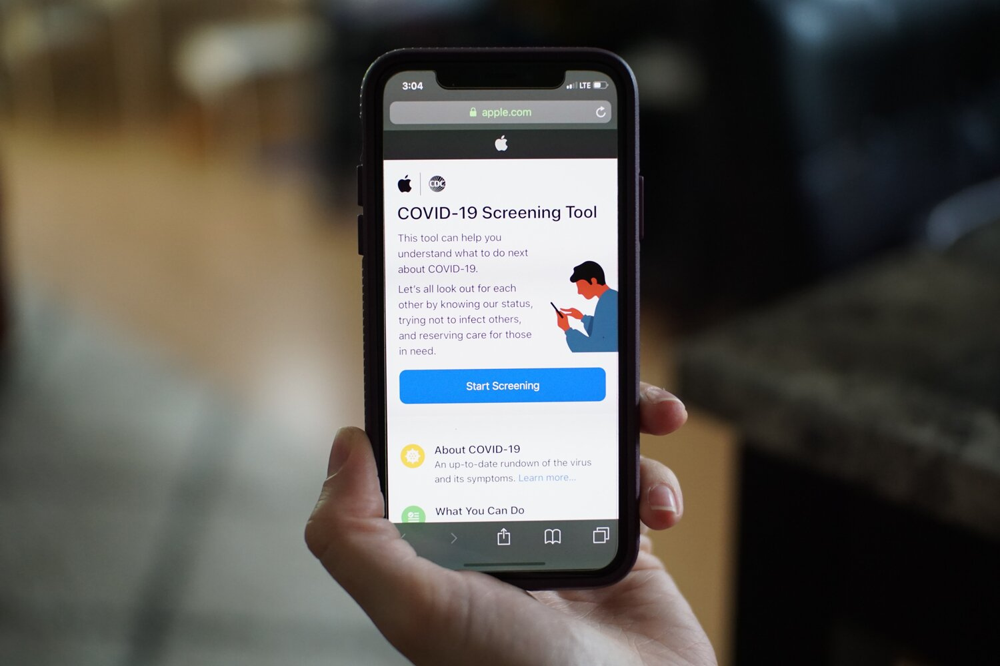

##  Is your digital space invisible or impossible?

By [Dr. Kristen Liesch](https://www.linkedin.com/in/kristenliesch/) from [Tidal Equality](https://www.tidalequality.com/), in collaboration with Kirsten Dodd and Bryony Anderson of Hey Nova

## Tidal Equality

Dr. Kristen Liesch is co-ceo of Tidal Equality, and co-creator with Anna Dewar Gully of the Equity Sequence™️, a series of equity-focused questions that equip teams with a practice they can apply to reduce bias and increase equity one question and one decision at a time. Learn more at [www.tidalequality.com/equity-sequence](www.tidalequality.com/equity-sequence)

## Our digital and real worlds during a pandemic

Quarantine, self-isolation, physical distancing… the coronavirus pandemic has sent us indoors like no other event in generations. My personal footprint has shrunk dramatically. Like so many others whose work is non-essential and can (theoretically) be completed from home, the “world” I inhabit now is exponentially more virtual, digital, online - and not by choice, but out of necessity.

And in the current state of affairs, I’m certainly among the most fortunate. I have a front yard where my kids can kick a soccer ball around. I have access to funds that give me enough of a buffer that I don’t quite need to panic about the fact my CRA online access is all tangled up. I’ll be okay. 

And, by the looks of it, a lot of people I know will be okay: my neighbours are landscaping their front yards, my friends on social media are taking second-language classes and taking a crack at fermenting cabbage.

But we’re not all okay. In fact, a lot of people are not okay in a very fundamental way. 

## Exacerbated inequalities

COVID-19 has, in many ways, laid bare the bias that exists in our systems (think: [lower testing](https://www.npr.org/sections/health-shots/2020/04/02/825730141/the-coronavirus-doesnt-discriminate-but-u-s-health-care-showing-familiar-biases) rates in black communities), and exacerbated existing inequalities (think: [children](https://www.bloomberg.com/news/articles/2020-03-26/covid-19-school-closures-reveal-disparity-in-access-to-internet) meant to learn at home without internet access).

For the past two weeks, my co-CEO Anna has been working with a tech [maven’s](https://www.linkedin.com/in/catherinechen-myshoperon/) [company](https://myshoperon.com/) and a local [food security](https://scarboroughfoodsecurityinitiative.com/) initiative to coordinate a Toronto-wide plan for getting food to hungry people. Because there are a lot of them. And they’ve been falling through the cracks. And in the process of wrestling with the challenges related to coordinating - at speed and scale - this sort of project, it’s become painfully obvious exactly how inequitable our systems - programs, communications, policies - can be, and are having baked into them as we speak during this pandemic. 

We’ve been asking questions like:

1. Does low turn-out to a local pop-up food pantry mean there is little need, or that people in need don’t know the pantry exists?
2. How is a person who is living alone meant to access food bank provisions if they’re also supposed to be in self-isolation?
3. When 2.4million Canadians don’t have at-home internet access - and the places they’d usually access wifi (cafes, public libraries) are now closed - how can they find the information and supports they need?

## People in the midst of pandemic: Amrita and Devon*

I know, without a doubt, there are equality champions, changemakers, and concerned citizens, volunteers, public servants, and others who are working very hard to get help to those who need it. Nevertheless, inequalities are exacerbated, even in the midst of good work.

Let me explain.

But first, meet Amrita

Amrita just came home from spending a few months in Palm Springs with her sister-in-laws, and she finds everything in Toronto - and the country - has changed. Not only is she told she must self-isolate for 14 days because she’s been out-of-country, she’s to remain in self-isolation until further notice because she’s over 70. It’s all pretty overwhelming. She wishes her sister-in-law were there to help her through this new challenge. Since her spouse died a few years ago, she’s had to weather some storms on her own. Nothing unusual for a woman of her age: cataracts which have affected her vision, and her arthritis has gotten worse. But she’s taken the knocks and pushed through; she’s swapped reading biographies for listening to them, and while she misses sketching, she’s taken some cooking classes and gets creative in the kitchen. 

Today, though, Amrita is at a bit of a loss. She’s not supposed to go out to buy groceries, and even if she were to venture out, her local Little Portugal grocer doesn’t seem to be open. She’s never tried online grocery shopping before, and realizes she’ll have to give that a go sooner rather than later. But first she decides to get good and caught up. Her radio is tuned to CBC Toronto, and she’s heard more than once that 211Toronto.ca is where she can go for all the latest information and resources, so she sits down with her iPad and powers up.

Next, meet Devon.

Devon is pouring himself another cup of coffee. From the sound of the creaking floorboards overhead, he figures that his upstairs neighbour has come home from wherever they go this time of year. His boyfriend somehow managed to get to know most of the people in their 16-unit apartment, but Devon had kept mostly to himself since his accident. 

Devon had put 15 years into his job at a roofing manufacturing plant when he got caught in some machinery and lost his hand. But he lost a lot more than that. He was put on light duty when he was able to go back to work, but that saw him assigned to a different role, and the learning curve, combined with worsening mental health issues, were more than he could cope with, so he took disability. He’s been working the occasional shift at the grocer around the corner, but they’ve had to close up for the time being, and they laid him off. 

Now, the creaking floorboards above and the occasional passing pedestrian are the only humans Devon feels he has around him, and he knows he’s going to need help soon. His parents and sister are in British Columbia, and they’ve got their own challenges - job losses, kids to homeschool. He certainly doesn’t want to ask his parents for money… with the ways the markets are going, their retirement fund is at risk. Sooner than later, Devon’s going to need help with food. He heard Mayor Tory mention 211Toronto.ca in today’s press conference, so he opens a search engine on his phone.

~

Amrita and Devon represent some of the people who really need access to the kind of information a site like 211Toronto.ca provides: information about mental health services, food security programs, income support. There’s a 24/7 helpline, a live chat. And while 211Toronto.ca has built their site - with all its information, language translation, live chat, multiple hyperlinks - for folks like Amrita and Devon. It hasn’t been built for Amrita and Devon.

## When the digital world is invisible or impossible

Like far too many spaces, both real and virtual, the accessibility of that space has been (inadvertently overlooked) such that the failure to build access into the design causes a failure in the system itself. 

Now let me introduce you to [Kirsten Dodd](https://www.linkedin.com/in/kirsten-dodd-heynova/) so she can explain.

**Kirsten describes Amrita’s experience:**

“When Amrita navigates to the 211Toronto.ca site she is drawn towards the site's main “search” feature. She can’t read the tiny print on the search form, so she looks for a way to increase it. 

She never does manage to find the “change font size” option. (Even if she did, and tried tapping on the buttons to increase font, it would be incredibly difficult, as they’re impossibly small, and her hands are shaky and stiff from her arthritis. She would click on the wrong links that are nearby many times before ever achieving her goal. This would increase her frustration.) Amrita does notice the note to “look on a different site for covid specific information,” but it took her a while, because the page layout doesn’t allow for conceptual interpretation of information. 

“When Amrita makes it to the COVID website in search of a grocery delivery service, the various icons draw her attention between the location bar and she squints to read the copy that has poor colour contrast. There is a link that says “grocery delivery service” with minimal information explaining how the site works. She taps on this link but it’s warning her she needs to put in her location. After trial and error she realizes the tool doesn’t allow her to enter “Little Portugal” and she must either enter her postal code or enter the city of Toronto. There are extended filtering options available but because of poor user experience it is unclear how to use them before the options are displayed, which means Amrita has to sort through a large list of options - many of which are not actually available to her. 

“When Amrita looks at the list, the “SHOW MORE” text and button are so small she can’t even see it at first. She clicks on a few options by accident, but they are all charities (and she has money to pay), so she goes back, hoping to find more information on services that are right for her. Once she finds the grocery delivery services, it is unclear which are right for her, as she wants delivery but doesn’t need it to be free. 

She decides to try calling because she is confused, thus increasing the call volume to the 211 line instead of helping the overwhelmed staff. 

“So, in conclusion, in Amrita’s case, due to bad user experience and difficult font sizes, she ends up calling in because she is in pain from her arthritis and frustrated from her attempts. But even an able-bodied person with good sight would be frustrated by the user experience on the site.”

**Kirsten describes Devon’s experience:**

“When Devon navigates to the 211Toronto.ca site, he is immediately overwhelmed by the bombardment of content. The lack of conceptual layout and whitespace causes cognitive stress and the lack of organization begins to stir his anxiety. When he sees the covid relief link he clicks it to look for more resources. 

“He tries to add his neighbourhood - “Kensington Market” - because Toronto seems too vast of an entry (and he can never remember his postal code). It takes a moment for him to see that it says “no listings found”. He changes the search to “Toronto” and decides to start by looking for the nearest Food Banks. The list gives everything that is in Toronto, not sorting by how close it is to his location. This is not good for him because he needs somewhere close by as he doesn’t have his own transportation. The “show more” button is small and hard to click on the list items, but when he is able to click it doesn’t provide enough information, and what it does provide is unclear. He clicks into the first listing, but he’s not eligible for the services because of his age, so he tries another, but is again ineligible because of where he lives. Devon does this a few times before getting overwhelmed and disheartened. The whole process causes him extra stress and he begins to feel helpless, worsening his depression. While he’s confused and stressed by the online service, he really doesn’t want to call the phone number if he can avoid it, because he is socially anxious.

“Finally, he finds a listed service where he seems eligible, but he would have to go stand in line and this skyrockets his anxiety. He doesn’t feel like there is anything good for free food resources for him, so decides to look into financial support instead. Despite being important during covid, this is not listed on the covid support page. He goes back to the first website in hopes of locating financial support. After more time trying to navigate through an array of buttons and options, the website tells him he just needs to leave this site to go to the Canada Services website. This causes him more frustration and stress, and makes him feel like he has wasted his limited energy clicking around two different websites only to be told to go to another one entirely. 

“So, in conclusion, Devon has been sent on a wild goose chase to find resources. The process increased his anxiety and drained his energy, worsening his depression and what sense of self-sufficiency he might’ve had.”

## How can you assess accessibility?

Kirsten is co-founder with [Bryony Anderson](https://www.linkedin.com/in/bryony-anderson-266943160/) of Hey Nova. They get out of bed every day on a mission to make our digital world one where everyone has an equal opportunity to access all that world offers - connection, commerce, entertainment, information, innovation. But what keeps them up at night is exactly how our online spaces are designed, and designed in ways that prevent so many - too many - people from connecting, buying and selling, entertaining, informing, innovating.

The Hey Nova team knows there are missed opportunities - for users and the entities they access via the internet.

Here are some helpful facts from Hey Nova.

## Digital accessibility, user experience, and you

1. 22% of Canadians have at least one disability that affects their sight, hearing, or dexterity. Limitations like these can make or break a digital experience and this number doesn’t even account for temporary limitations or mental health barriers. 
2. An accessible website is better for all your users by improving the overall user experience. In commerce, for example, we know that 88% of online shoppers won’t return to a website after having a bad user experience. So, when you make your website accessible, you give everyone the best user experience - a necessity, in our opinion, as our world becomes ever more digital.
3. Good usability is great for business and can improve profits. By investing in user experience, studies show you can see a return of up to 1000% in profit, making web accessibility worth every penny. 
4. Users who can’t use your website might be missing out on essential information or essential services. In the cases illustrated above, these include grocery delivery or learning about financial support they may require and the poor accessibility prevents target users from benefiting from the resources available.

## Evolve your understanding of accessibility

In the physical world around us, there are signs - sometimes literal - that suggest physical accessibility has been taken into account: the wheelchair painted on a parking spot, the braille on the elevator button, the chirping crosswalk signal. And for those who don’t (yet) have accessibility challenges, these signs and symbols might paint a reductive picture of what “accessibility” means when, in fact, there are a myriad ways that people can experience barriers to full and equal participation in the world around them. 

“Colour contrast, for example, is often overlooked,” explains Kirsten. “However, an estimated 2.6 million Canadians are colour blind. If a website has poor colour contrast, those users can’t read the content. This also doesn’t only affect people who are colour blind. Poor colour contrast will affect elderly users as well as users trying to read on a phone while outside in the sun. Accessible technology for the elderly is sometimes deemed of lower importance because the current generation of elderly folks are less likely to be online. But we now have generations of people who have grown up online. If we don’t start developing accessible practices now, we will be excluding ourselves from our digital futures. In other words, making the web more accessible doesn’t just benefit more people today, it would be improving our own experiences for the future.”  

Kirsten has a few more insights: “Simple things like long blocks of text in italics can pose an issue for people with dyslexia, which affects an estimated 3 million Canadians. Reading is already more difficult for them, but italic text makes it even harder. There are measures that can be taken on a website to make it easier with well-spaced text, lowercase typefaces, and larger font sizes. Many with dyslexia will opt to utilize a screen reader when that is an option, but the majority of websites aren’t coded in a way a screen reader can conceptually interpret the content. Which is a whole other story.”

Most of us will never accumulate the catalog of accessibility considerations that compares to the one the team at Hey Nova draws on when they support organizations looking to open themselves up to a broader market, community, user base, etc. But we can start by acknowledging the fact we’ve all got blind spots. And probably lots of them. Even when it comes to our “target demographic” or “ideal user.”

## Bias exists, inequality is at the root of our problems, so what?

Bias is, after all, in the air we breathe. 

But bias creates inequalities. 

It prevents us from doing our best work. 

From achieving our full potential.

  > And bias isn’t just something that we all must contend with on a personal level, it’s something that we (the grand WE, but also very often the WE in power, and with privilege) have baked into our systems, our processes, our products, our spaces, our events, our investments, our content, our policies, our websites, our programs, our curricula…

If we want to interrupt the myriad biases that often so covertly exert their influence - if we want to maximize the reach and impact of whatever it is we are putting into the world - we need to get in the practice of asking the kinds of [questions that reveal](www.tidalequality.com/equity-sequence) those biases.(No, we don’t need more bias training, because [bias training doesn’t work](www.tidalequality.com/blog/dont-do-unconscious-bias-training).) We need to ask questions like: Are we creating with equity in mind? Who is doing the creating? Who are they creating for? And more. We need to get in the practice of inviting passionate people like those at Hey Nova to bring the skills and subject-matter expertise that can help us fill our gaps and achieve our full potential to the benefit of our causes and the people we (could also) serve.

Let’s start designing our world(s) - the physical and digital - for all!

<small class="footnote">\*Amrita and Devon are fictionalized, but their experiences, as described, are representative of the experiences of individuals who face similar challenges, both physiological and psychological.</small>

