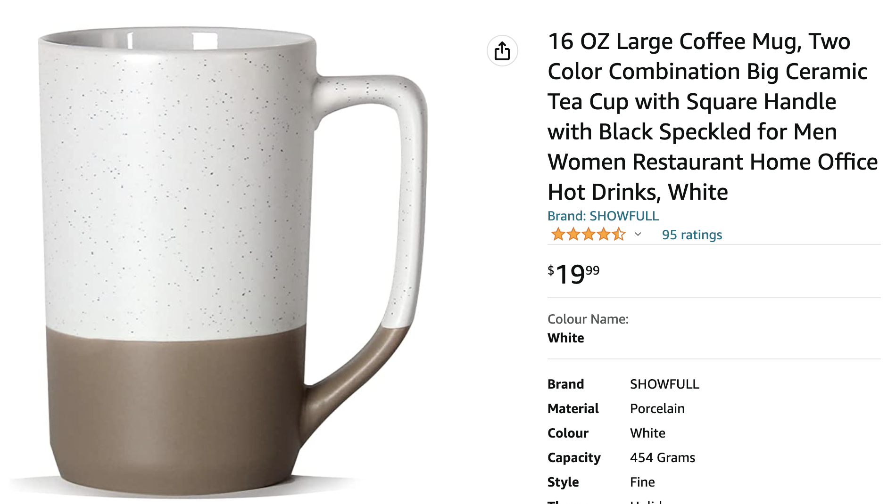

**Good Alt Text - let’s talk about it!**

## First of all, what is alt text, and why do you need it on your website?

Alt text (short for alternative text) describes the appearance or function of an image on your webpage, and it is added within the HTML code or in a field in your CMS (Content Management System).

Writing good alt text is incredibly important for providing an inclusive experience for your users since so much of our digital content is portrayed in imagery.

What’s more, it also improves your SEO and displays on the webpage if the image doesn’t load, improving the user experience for everyone.

## Good alt text versus bad alt text

Like many things, there are good and bad ways to write alt text. If written poorly, alt text can do more harm than good, confusing the user and impeding accessibility. 

Below, we’ve compiled a few key rules to follow when writing your own alt text for digital accessibility:

### 1. Be specific and descriptive

Make sure you keep it simple and easy to understand while describing the image clearly. To help you with this, imagine describing the image briefly over the phone to someone.

### 2. Use keywords sparingly

While alt text is good for SEO, its main purpose is for users that need a screen reader and is not there to put every keyword you think of (think Amazon product descriptions as a good what **NOT** to do!). What’s more, Google has ways of telling when you are adding too many keywords without context, and this can actually result in you being ranked down! 

### 3. Don’t repeat yourself

Does the alt text help paint a picture for your user, or is it just filler? If the alt text is just a repeat of other text on the page, it is better for users if you leave the alt text null (alt=“”). For example, if you have a plain product image beside the name of the product, don’t just add the name of the product in the alt text. Why? Because you are repeating the same thing twice for screen reader users. This is more disruptive than helpful.   

### 4. Don’t add alt text to decorative images

Images that provide no additional context, like brand graphics or decorative icons, have no significance or meaning to a non-visual user; therefore, it’s best to avoid adding alt text to these as it won’t help them understand the page better.

## How do you know if your alt text is good enough to add?

Finally, the best way to check if your alt text is good for digital accessibility is to simply close your eyes and describe the image out loud. Does it make sense to you? Would it make sense if you were blind? If yes, then you’ve got it! Go ahead and add that to your image. If it doesn’t make sense, try again, you’ll get there! 

With a little practice, it will soon become second nature.

Below, we’ve given an example of both bad and good alt text.

### **Bad alt text example 1 (too much information):**

Image of a close-up shot of a very cute, slightly older dog wearing a human pair of black sunglasses with his owner in the reflection, looking very happy and basking in the sun. 

**Bad alt text example 1 (too many keywords):**

Puppy dog golden retriever sunglasses park pet store

**Good alt text example:**

A golden retriever wearing sunglasses in the park.

We hope these tips helped; good luck on your journey toward improved accessibility!
