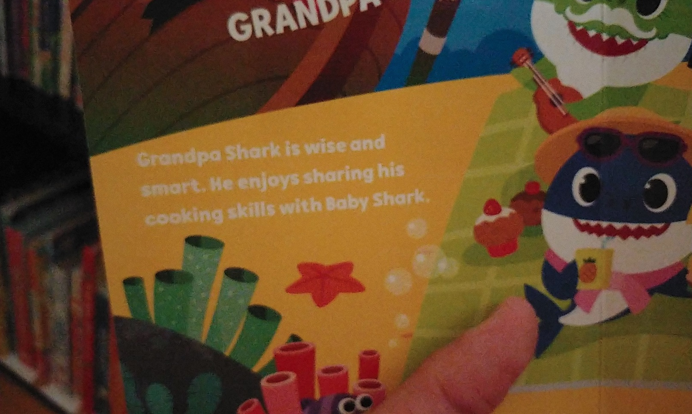

Whether or not you’ve spent time digging through [**Web Content Accessibility Guidelines**](https://www.w3.org/WAI/standards-guidelines/wcag/) (**WCAG**), you’ve likely heard something about colour contrast. Perhaps it was during a debate with a designer over font colours, or a stakeholder review of accessibility audit results. It may have been in high school art class, reviewing colour theory.

Maybe you haven’t heard of it at all. If so: congratulations, you’ve come to the right place!

## What _is_ colour contrast?

If you’re thinking of [complementary colours, the colour wheel, and other contrast-based elements of colour theory](https://www.invisionapp.com/inside-design/understanding-color-theory-the-color-wheel-and-finding-complementary-colors/), you’re not too far off. It’s a reasonable place to start. If nothing else, it’s good to know why [so many movie posters look more-or-less the same](https://www.obsev.com/entertainment/orange-and-blue-movie-posters/).

")

When it comes to web accessibility, contrast refers more specifically to [relative luminosity](https://www.accessibility-developer-guide.com/knowledge/colours-and-contrast/how-to-calculate/#relative-luminance), rather than tone or saturation. Think of luminosity as a colour’s lightness; or how bright it appears on a scale from black to white.

Web accessibility takes into account the difference between the lightness of text and the background it is placed over. Because colours on a screen are represented by mathematical values, using **[RGB](https://en.wikipedia.org/wiki/RGB_color_model)** (_Red, Green, Blue_), **[CMYK](https://en.wikipedia.org/wiki/CMYK_color_model)** (_Cyan, Magenta, Yellow, blacK_), or **[HSL](https://en.wikipedia.org/wiki/HSL_and_HSV)** (_Hue, Saturation, Lightness_), the difference in lightness [can be easily calculated](https://www.accessibility-developer-guide.com/knowledge/colours-and-contrast/how-to-calculate/#the-formula). That calculation gives us our contrast ratio: a handy way of helping us determine just how much our text stands out from its background!

, taking a look at our blue and orange movie poster palette.")

The [**WCAG** success criteria set four key contrast ratios](https://www.w3.org/WAI/WCAG21/Understanding/contrast-minimum.html) to achieve based on font size, weight, and [compliance level (**AA** and **AAA**)](https://www.w3.org/WAI/WCAG21/Understanding/contrast-enhanced):

- Normal text (Level **AA**) - **4.5:1**
- Large text (Level **AA**) - **3:1**
- Normal text (Level **AAA**) - **7:1**
- Large text (Level **AAA**) - **4.5:1**

## What does this all mean?

For an accessibility nerd, it’s pretty easy to get lost in all the fun details of numbers, ratios, guidelines, and success criteria. For the rest of you, what do these numbers and ratios really mean?

Think of the **WCAG**’s minimum contrast ratios as reaching for two basic goals:

1. Translating a broad human experience into a value which can be calculated
2. Setting a measurable baseline to help some humans have a better experience

While the exact contrast ratios [aren’t always fit for everyone](https://uxmovement.com/buttons/the-myths-of-color-contrast-accessibility/), they exist to help bring a basic level up for a wider range of people. Setting a specific value is not perfect, but it offers a metric that can be measured, adjusted, and [written into law](https://www.aoda.ca/complying-with-aoda-wcag-2-0-distinguishable-content/). Like any other accessibility effort, it’s a step to help gain wider care and acceptance.

## When and where does colour contrast matter?

Assuming you have more pressing plans on a Friday night than [reviewing the **WCAG**’s newest draft](https://www.w3.org/WAI/standards-guidelines/wcag/new-in-22/), let’s look at something beyond the numbers and guidelines.

The primary goal of the **WCAG** is to improve accessibility for people with disabilities. In that vein, colour contrast immediately impacts people with [low vision, including macular degeneration, glaucoma, cataracts](https://webaim.org/articles/visual/lowvision), and others. The more our text and other graphical elements stand out from the background, the more likely folks who are diagnosed with these disabilities will be able to read and understand our content.

For people who are colour-blind, colour contrast takes on additional importance. Maintaining a contrast in luminosity between our colours ensures that people with [deficiencies in red-green, blue, or no colour perception](https://webaim.org/articles/visual/colorblind) can still perceive our text, error messages, links, and other colour-coded elements throughout an interface.

")

One of the beautiful side-effects of effort put into accessibility is the impact these improvements have for everyone. This phenomenon is commonly referred to as the “[curb cut effect](https://uxdesign.cc/the-curb-cut-effect-universal-design-b4e3d7da73f5)”, or “[digital/electronic curb cuts](https://www.abilities.ca/technology/the-electronic-curb-cut/)” for the web, touch screens, and other digital devices. Listen to [**99% Invisible**’s “Curb Cuts” episode](https://99percentinvisible.org/episode/curb-cuts/) for a well-told rendition of the story behind the term.

When it comes to colour contrast, it doesn’t take much to put anyone in a situation where it matters. Have you ever worked in an office where the morning or afternoon sun streaks across your monitor, making it tough to see anything on the screen? How about looking up directions on your phone while outside on a sunny day?

Perhaps you use a blue-light filter on your devices to [help reduce chronic insomnia](https://www.webmd.com/sleep-disorders/sleep-blue-light). Maybe you’ve just crested your mid-30’s and are quickly starting to realize how intent [your body (including your eyes) seems on breaking down](https://www.nvisioncenters.com/education/20-30-year-olds/). If you’ve read bedtime stories to small children, as I do every night, you’ve surely discovered how tough it is to make out low-contrast text in the dark!

In short - colour contrast helps _some_ people a whole lot. And then it helps a _whole lot_ of people in smaller and less-obvious ways.

## Further reading

If this piece has piqued your interest and you’d like to read deeper on the subject, here are a few resources to check out:

- [“Contrast and Color Accessibility” from WebAIM](https://webaim.org/articles/contrast/)
- [“Color Contrast And Why You Should Rethink It” from Smashing Magazine](https://www.smashingmagazine.com/2014/10/color-contrast-tips-and-tools-for-accessibility/)
- [“Contrast is King” from A List Apart](https://alistapart.com/article/contrast-is-king/)
- [“Colors with Good Contrast” from **W3C**’s Web Accessibility Initiative](with)
